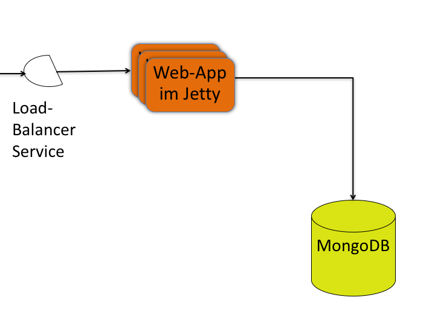

# Sling DevOps with Kubernetes on the Google Cloud Platform
The goal of this project is, to provide a reusable production ready Sling infrastructure and to optimize and enhance it over time.
That's why bug reports, fixes, enhancements and comments are very much appreciated.
I'm more of a developer than an ops guy. So please validate for yourself as well if this project works for you.
This project uses the [sample-bundle](https://github.com/sandroboehme/sling-devops-experiments/tree/master/sample-bundle) as sample web application.

## The status
*In Development*

There are missing main things like DB backup and recovery, securing Sling, HTTPS, adding more health checks and implementing the suggestions from the MongoDB startup logs. But also main cost optimizations like removing the use of a load balancer, use of [GCE preemptiveness](https://cloud.google.com/compute/docs/instances/preemptible) and thinking about autoscaling to remove not needed cluster nodes ...

## Prerequisites

### Command line tools
- gloud: 
https://cloud.google.com/sdk/
- kubectl: 
gcloud components install kubectl

### Building and publishing the image
If you want to jump right into building up the cluster you can skip this part as sample-app images that are used in the setup are already available.

#### Setup the authentication to e.g. Docker Hub
The different ways to do it can be found in [the fabric8 docu](https://dmp.fabric8.io/#authentication). The one that worked for me was, adding the following snippet to `~/.m2/settings.xml`:
```
<settings>
  <servers>
    <server>
      <id>docker.io</id>
      <username>[your-docker.io-username]</username>
      <password>[your-docker.io-password]</password>
    </server>
  </servers>
</settings>
```

#### The command 
    mvn clean process-resources slingstart:prepare-package slingstart:package docker:build docker:push

## This project currently supports two configurations.
### Web server and application with single MongoDB instance. 


It allows to horizontally scale the web-app in Jetty and to release a new version without downtime. It allows only one MongoDB image running. But it will be automatically restarted if the process dies. Check out more in the [src/main/k8s/single-mongo subfolder](src/main/k8s/single-mongo/README.md)

### Web server and application with MongoDB ReplSet instances.


Check out more in the [src/main/k8s/replset-mongo subfolder](src/main/k8s/replset-mongo/README.md)

## Start locally

### Via java -jar
* Start the MongoDB Docker container: `docker run -p 27017:27017 --name mongo mongo`
    * Specifies the handy container name `mongo`
    * Exposes the port 27017 of the image to 27017
* Define the start parameter for the server
    * `export DBG="-Xmx384M -agentlib:jdwp=transport=dt_socket,address=30303,server=y,suspend=n"`
* Start the web server: `java $DBC -jar target/sample-launchpad-2.0.0.jar -c slinghome`
* Sling is available after startup at http://localhost:8080
* The sample app is available at http://localhost:8080/content/mynode.test
* Kill the web server (via ctrl-c)
* Stop the MongoDB Docker container `docker stop mongo`
* Remove the MongoDB Docker container `docker rm mongo`

### The docker image
* Start the MongoDB Docker container: `docker run --name mongo mongo`
    * Specifies the container name `mongo` to be used as host name later
* Start the Docker container of the web server and link to the MongoDB server
    * `docker run -e MONGO_HOST='mongo' -p 8080:8080 --link mongo sandroboehme/sample-app:2.0.0`
    * Exposes the port 8080 of the image to 8080
* Sling is available after startup at http://localhost:8080
* The sample app is available at http://localhost:8080/content/mynode.test
* Stop the MongoDB Docker container `docker stop mongo`
* Remove the MongoDB Docker container `docker rm mongo`
* Find the container id of the web server with `docker ps -a`
* Kill it like the MongoDB container

## Debugging
* You can run `kubectl get [pods/services/deployments/...] [id]` to get the main information about the entity. For a rolling update of a new Pod image you can add `-w` like this `kubectl get pods -w` to see how the Pods are gracefully created and terminated. Using `describe` in stead of `get` is useful if you need more detailed information. You can always use the singular and plural form for entities in the commands. 
* Use `kubectl logs <podname>` to see the stdout of the image in the Pod. Add the image name if there is more than one image in the Pod.
* Use `kubectl exec -it <podname> bash` to get the command line for an image within a Pod.
