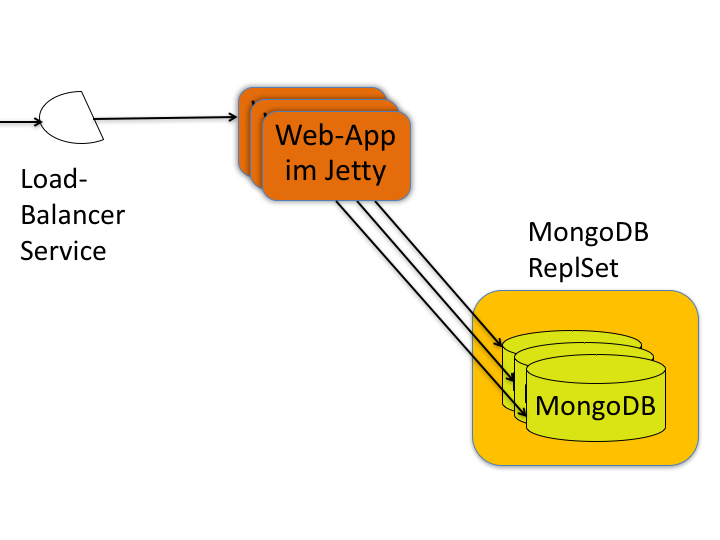
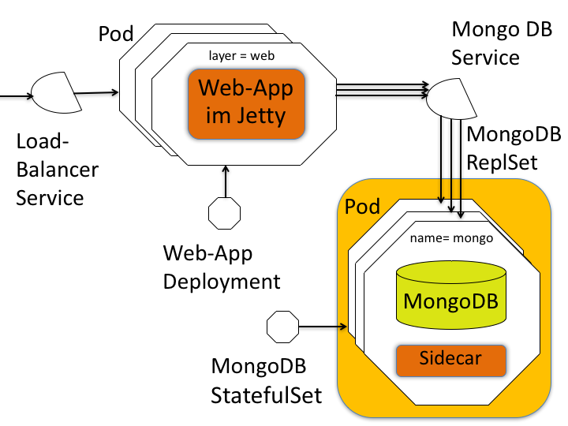

# Sling DevOps with Kubernetes on the Google Cloud Platform
The goal of this project is, to provide a reusable production ready Sling infrastructure and to optimize and enhance it over time.
That's why bug reports, fixes, enhancements and comments are very much appreciated.
I'm more of a developer than an ops guy. So please validate for yourself as well if this project works for you.
This project uses the [sample-bundle](https://github.com/sandroboehme/sling-devops-experiments/tree/master/sample-bundle) as sample web application.

This project supports this high availability setup:



But allows cheaper configurations as well.

## The status
*In Development*

There are missing main things like DB backup and recovery, securing Sling, HTTPS, adding more health checks and implementing the suggestions from the MongoDB startup logs. But also main cost optimizations like removing the use of a load balancer, use of [GCE preemptiveness](https://cloud.google.com/compute/docs/instances/preemptible) and thinking about autoscaling to remove not needed cluster nodes ...

## Prerequisites

### Command line tools
- gcloud: 
https://cloud.google.com/sdk/
- kubectl: 
`gcloud components install kubectl`

## Building and publishing the image
If you want to jump right into building up the cluster you can skip this part as sample-app images that are used in the setup are already available.

### Setup the authentication to e.g. Docker Hub
The different ways to do it can be found in [the fabric8 docu](https://dmp.fabric8.io/#authentication). The one that worked for me was, adding the following snippet to `~/.m2/settings.xml`:
```
<settings>
  <servers>
    <server>
      <id>docker.io</id>
      <username>[your-docker.io-username]</username>
      <password>[your-docker.io-password]</password>
    </server>
  </servers>
</settings>
```

### The command 
    mvn clean process-resources slingstart:prepare-package slingstart:package docker:build docker:push

## Start locally without a cluster

### Via java -jar
* Start the MongoDB Docker container: `docker run -p 27017:27017 --name mongo mongo`
    * Specifies the handy container name `mongo`
    * Exposes the port 27017 of the image to 27017
* Define the start parameter for the server
    * `export DBG="-Xmx384M -agentlib:jdwp=transport=dt_socket,address=30303,server=y,suspend=n"`
* Start the web server: `java $DBC -jar target/sample-launchpad-2.0.0.jar -c slinghome`
* Sling is available after startup at http://localhost:8080
* The sample app is available at http://localhost:8080/content/mynode.test
* Kill the web server (via ctrl-c)
* Stop the MongoDB Docker container `docker stop mongo`
* Remove the MongoDB Docker container `docker rm mongo`

### The docker image
* Start the MongoDB Docker container: `docker run --name mongo mongo`
    * Specifies the container name `mongo` to be used as host name later
* Start the Docker container of the web server and link to the MongoDB server
    * `docker run -e MONGO_HOST='mongo' -p 8080:8080 --link mongo sandroboehme/sample-app:2.0.0`
    * Exposes the port 8080 of the image to 8080
* Sling is available after startup at http://localhost:8080
* The sample app is available at http://localhost:8080/content/mynode.test
* Stop the MongoDB Docker container `docker stop mongo`
* Remove the MongoDB Docker container `docker rm mongo`
* Find the container id of the web server with `docker ps -a`
* Kill it like the MongoDB container


## Start in a cluster
This is the configuration that will be created in the upcoming chapters:



In case of any problems check out the debugging chapter below.

### Create the cluster in the Google cloud
1. Go to the [Google Cloud Console](https://console.cloud.google.com)
1. Create a project for this setup from the dropdown left beside the big search field. We will call it `sling` in this example. If the project name is not unique a number suffix will be added automatically that you need to use in the commands as well.
1. Navigate to the Kubernetes engine / Container engine from the menu on the left and activate it.
1. The following commmand creates a cluster of 3 g1-small nodes in the US. You find the pricing [here](https://cloud.google.com/compute/pricing#predefined_machine_types). We will be using the name `sling-cluster` throughout this project. You can try to use smaller machine types and fewer nodes. Especially if you have only one MongoDB instance. Just one hint: If you hit a problem that doesn't seem to be justified by the change you did then try first to raise the number of nodes or choose a bigger machine type. It took me way to much time trying to solve the wrong problem as I have just had not enough machine power.

    gcloud container \
    clusters create "sling-cluster" \
    --project "sling" \
    --zone "us-central1-a" \
    --machine-type "g1-small" \
    --num-nodes "3" \
    --network "default"
### If the cluster is already there you can just reauthenticate 
   
    gcloud container clusters get-credentials sling-cluster \
      --project "sling" \
      --zone "us-central1-a"

### Create the cluster locally in a Minikube
If you want to try that out locally without the Google cloud you can use this Minikube setup. 
* Install Minikube and its driver: https://github.com/kubernetes/minikube/blob/master/docs/drivers.md#hyperkit-driver
* `kubectl config use-context minikube`
* `minikube start --vm-driver=<driver>`
* Now minikube is in the same state as you would be after you started the cluster in the Google cloud

### How the web layer is configured
The `web-service.yml` file defines the Kubernetes Service of type load balancer for the [https://kubernetes.io/docs/concepts/workloads/pods/pod/](Pods) labeled `layer=web`. It provides a public IP address and forwards the requests to the Pods that are ready. If Pods (re) start they will get new cluster-local IP addesses but the Service knows them by using the selector and can still provide the web-app service to the stable external IP.

The [labels](https://kubernetes.io/docs/concepts/overview/working-with-objects/labels/)  of the selector are defined in the field `spec.template.metadata.labels` of the file `web-deployment.yml`. It (re) creates two Pods for the web-app. They are configured to use the application image we previously uploaded to Docker-Hub. The [readiness probe](https://kubernetes.io/docs/tasks/configure-pod-container/configure-liveness-readiness-probes/) does an HTTP-GET on /content/mynode.test and checks if the 200 status is returned to tell the load balancer Service that it can handle requests or that it should be removed from the load balancer if it is currently not ready. If a Pod gets unavailable the Service only knows it from periodic testing. If requests arrive the web server in the Pod during that period when the service has not yet recognized that the Pod is down it will get errors. To avoid that, the `preStop` hook sets the Pod to unready before it is [terminated](https://kubernetes.io/docs/concepts/workloads/pods/pod/#termination-of-pods) and waits a few seconds to give the load balancer time to recognize the unreadiness and remove it from the list of serving pods before errors will be returned. 
The web-deployment also defines the host name(s) that should be used to contact the MongoDB server.  

### How the DB layer is configured
For the MongoDB no Deployment but a [StatefulSet](https://kubernetes.io/docs/concepts/workloads/controllers/statefulset/) is used in `mongo-statefulset-[single/replset].yaml` to initially create the DB-Pods with a new cluster ip. It also makes sure that the Pods are recreated if the process dies.
The `spec` section of the StatefulSet defines the Pod template that should be used to (re) create the Pods. It describes the image name `mongo` at Docker-Hub that should be used, the Container- and the Pod-Port and the mount that should be used to store the data.
As the web-app does not know in advance the host of the MongoDB that the web-deployment will use, it is set up to use the DNS name `mongo` as you see in the `web-deployment.yml`. 
The StatefulSet adds an ordinal index to the Pod name and together with the [Headless Service](https://kubernetes.io/docs/concepts/services-networking/service/#headless-services) it provides the DNS names for the MongoDB pods that are used in the `web-deployment.yml`.
If you want to use the MongoDB in a ReplSet mode you can use the `mongo-statefulset-replset.yaml` or `mongo-statefulset-single.yaml` otherwise.
In `mongo-statefulset-replset.yaml` the `name=mongo` Pods also have the [Sidecar](https://github.com/cvallance/mongo-k8s-sidecar/tree/master/example/StatefulSet) image inside. This is a NodeJS server that uses the [Kubernetes API](https://kubernetes.io/docs/api-reference/v1.5/#statefulset-v1beta1) to join or remove MongoDB instances to or from a MongoDB Replica Set when the according MongoDB Pods have been created or removed.

### Apply the persistent drive
If you would like to have a fast but more expensive setup call `kubectl apply -f googlecloud_ssd.yaml` and change the `storage-class` in `mongo-statefulset.yaml` from `slow` to `fast`.

### Apply the Service and StatefulSet (with specified persistent drive)
Make sure you have set the storage size at the end of the file according to your requirements.
`kubectl apply -f mongo-statefulset-replset.yaml` in case you want to use the MongoDB replication or  
`kubectl apply -f mongo-statefulset-single.yaml` in case you only need one MongoDB instance
In case you run this setup in the minikube you can use `mongo-statefulset_single-local.yaml`.

### Apply the web-app Deployment with its Pods after the DB Pods are ready
If you don't use the ReplSet make sure you remove the other two MongoDB host names from the web-deployment file.
`kubectl apply -f web-deployment.yml`

### Apply the load balancer service
`kubectl apply -f web-service.yml`

### Get public IP address <a name="get-public-ip"></a>
In the Google cloud you can run:
  `kubectl describe service -l name=web`
The one next to `LoadBalancer Ingress` is the one to be used for `http://<ip-address>/content/mynode.test`.
In the Minikube you can run `minikube service web` to get the resulting IP and open it in the browser.

### Scale up
#### Raise the number of nodes if needed
    gcloud container \
      clusters resize "sling-cluster" \
      --project "sling" \
      --zone "us-central1-a" \
      --size 3
#### Add web-application instances
Raise the number of replicas in the `web-deployment` file and call again
`kubectl apply -f web-deployment.yml`.

### Rollout a new application version
Call `watch -n 0.25 "curl http://<ip-address>/mynode.test"` to see every 1/4 second if it gets unavailable.
Change the image version in the `web-deployment` file (see example in the file) and call again
`kubectl apply -f web-deployment.yml`.
You will see that Pods get updated gracefully `curl` should not yield any errors from the requests of the curl command. 

## Pause project to avoid costs from Google
Set the number of replicas in the web-deployment and the MongoDB instance to `0` and call again
`kubectl apply -f` with the respective files. This way Kubernetes doesn't try to create pods after the nodes are removed from the cluster with the following command:

    gcloud container \
      clusters resize "sling-cluster" \
      --project "sling" \
      --zone "us-central1-a" \
      --size 0

This stops creating costs for the nodes.
It hasn't been evaluated yet what other costs (load balancer, stores,..) need to be avoided and how to do that (except deleting the whole cluster or project).
  
## Cleanup

    gcloud compute disks delete \
      --project "sling" \
      --zone "us-central1-a" \
      mongo-disk
  
    kubectl get all
    kubectl delete service --all
    kubectl delete deployments --all
    kubectl delete statefulset --all

    gcloud container clusters delete "sling-cluster" \
      --project "sling" \
      --zone "us-central1-a" 
    
   or
    
    minikube delete
    
Then you can go the the `Compute Engine` configuration in the Google Cloud console and navigate to `drives` there you can delete the drives.

## Debugging
* You can run `kubectl get [pods/services/deployments/...] [id]` to get the main information about the entity. For a rolling update of a new Pod image you can add `-w` like this `kubectl get pods -w` to see how the Pods are gracefully created and terminated. Using `describe` in stead of `get` is useful if you need more detailed information. You can always use the singular and plural form for entities in the commands. 
* Use `kubectl logs <podname>` to see the stdout of the image in the Pod. Add the image name if there is more than one image in the Pod.
* Use `kubectl exec -it <podname> bash` to get the command line for an image within a Pod.
